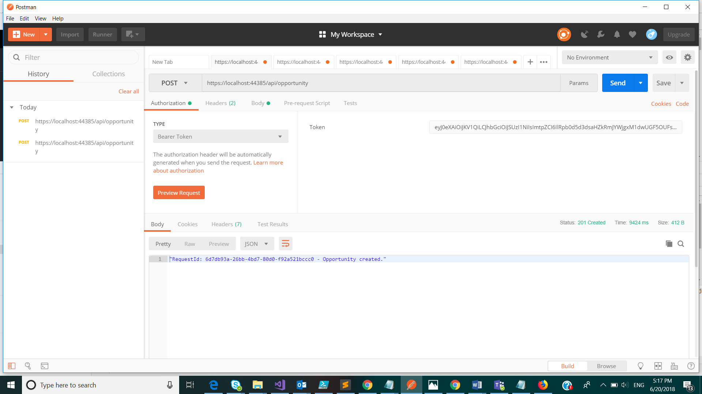

#
# Create Opportunity

Create an opportunity

## Permissions

The following permission is required to call this API.

- User should have the role of &#39;Relationship Manager&#39; in UserRoles list in Sharepoint and hence member of the AD group associated with this role.

## HTTP request

> POST \{applicationUrl}/api/opportunity

### Request headers

| **Key** | **Value** |
| --- | --- |
| Authorization | Bearer {token}. Required. |
| Content-Type | application/json |

### Request body

| **Option** | **Value** |
| --- | --- |
| raw | JSON(application/json) |

### Response

If successful, this method returns 201 Created response code.

Response body will contain a guid and a message that indicates success.

### Example

##### Request

Here is an example of the request.

> POST \{applicationUrl}/api/opportunity

##### Response

Here is an example of the response.

201 Created

Response body

> &quot;RequestId: 6d7db93a-26bb-4bd7-80d0-f92a521bccc0 - Opportunity created.&quot;

##### Screenshot from Postman

 

