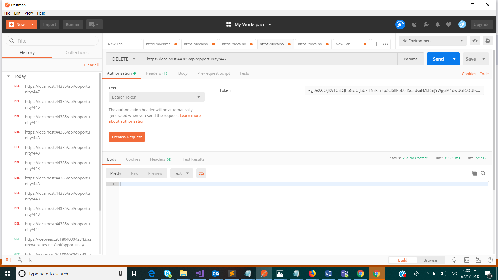

#
# Delete Opportunity

Delete an opportunity

## Permissions

The following permission is required to call this API.

- User should have the role of &#39;Relationship Manager&#39; in UserRoles list in Sharepoint and hence member of the AD group associated with this role.

## HTTP request

> DELETE \{applicationUrl}/api/opportunity/\{opportunityId}

### Request headers

| **Key** | **Value** |
| --- | --- |
| Authorization | Bearer {token}. Required. |

### Request body

Do not supply a request body for this method.

### Response

If successful, this method returns 201 Created response code.

Response body will contain a guid and a message that indicates success.

### Example

##### Request

Here is an example of the request.

> DELETE \{applicationUrl}/api/opportunity/\{opportunityId}

##### Response

If successful, this method returns 201 Created response code. It does not return anything in the response body.

##### Screenshot from Postman

