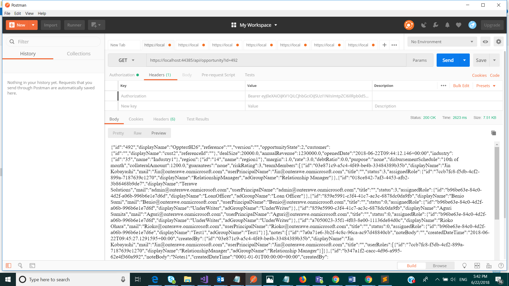

# Get Opportunity

Get an opportunity object

## Permissions

The following permission is required to call this API.

- User should have the role of &#39;Relationship Manager&#39; in UserRoles list in Sharepoint and hence member of the AD group associated with this role.

Or

- User should have the role of &#39;Loan Officer&#39; in UserRoles list in Sharepoint and hence member of the AD group associated with this role.

## HTTP request

> GET \{applicationUrl}/api/opportunity?id=\{opportunityId}

### Request headers

| **Key** | **Value** |
| --- | --- |
| Authorization | Bearer {token}. Required. |

### Request body

There is no Request body for this call.

### Response

If successful, this method returns 200 OK response code.

### Example

##### Request

Here is an example of the request.

> GET \{applicationUrl}/api/opportunity?id=\{OpportunityId}

##### Response

Here is an example of the response.

> 200 OK

##### Screenshot from Postman

 
