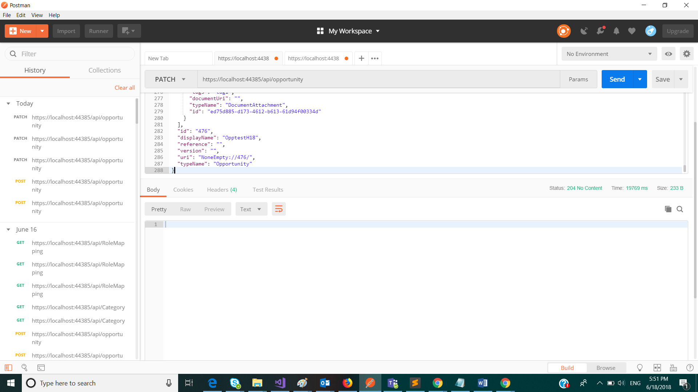

# Update Opportunity

Update an opportunity

## Permissions

The following permission is required to call this API.

- User should have the role of &#39;Loan Officer&#39; in UserRoles list in Sharepoint and hence member of the AD group associated with this role.
- User should have been assigned role of "Loan Officer" in the opportunity. Check TeamMembers array in the opportunity json object. Sample of a item in TeamMembers array given below, please refer to the assigned Role that denotes the user&#39;s role in this opportunity:
<code>
>{

         "id":"018ce842-7af3-4453-afb2-3b86468b9de7",

         "displayName":"Terawe Solutions",

         "mail":"admin@onterawe.onmicrosoft.com",

         "userPrincipalName":"admin@onterawe.onmicrosoft.com",

         "title":"",

         "status":1,

        "assignedRole":{

            "id":"b96be63e-84c0-4d2f-a06b-996b6e1e7d6d",

            "displayName":"LoanOfficer",

            "adGroupName":"Loan Officer"
         }

</code>      

## Common operations

This lists out the important sections of the Opportunity that you can update.

#### Opportunity Status

Section Name- opportunityState

Sample json section

> "opportunityState":2

List of valid opportunity states.

>        Creating =  1 ; 
>        InProgress = 2;
>        Assigned = 3;
>        Draft = 4;
>        NotStarted =  5;
>        InReview = 6;
>        Blocked =  7;
>        Completed =  8;
>        Submitted = 9;
>        Accepted = 10;

#### Customer Decision

Section Name- customerDecision

Sample json section

 <pre><code> "customerDecision": {

      "typeName": "Category",

      "id": "",

      "approved": false,

      "approvedDate": "0001-01-01T00:00:00+00:00",

      "loanDisbursed": "0001-01-01T00:00:00+00:00"
}
   </code></pre>

#### Team Members

Section Name- teamMembers

Sample json section
<pre><code>
 "teamMembers":[ { 
 
         "id":"03e871c9-a5c4-4f49-be4b-33484389b35b",

         "displayName":"Jin Kobayashi",

         "mail":"Jin@onterawe.onmicrosoft.com",

         "userPrincipalName":"Jin@onterawe.onmicrosoft.com",

         "title":"",

         "status":3,

         "assignedRole":{

              "id":"7ccb7fc8-f5db-4cf2-899a-7187639c1270",

                "displayName":"RelationshipManager",

                "adGroupName":"Relationship Manager"  } 
            }
            , 
            {

            "id":"018ce842-7af3-4453-afb2-3b86468b9de7",

            "displayName":"Terawe Solutions",

             "mail":"admin@onterawe.onmicrosoft.com",

          "userPrincipalName":"admin@onterawe.onmicrosoft.com",

         "title":"",

         "status":1,

         "assignedRole":{

            "id":"b96be63e-84c0-4d2f-a06b-996b6e1e7d6d",

            "displayName":"LoanOfficer",

            "adGroupName":"Loan Officer" } 
            }
        ]

</pre></code>

#### Checklist data

Section Name- checklists

Sample json section

<pre><code>
 "checklists”:[
{
 "id”: "CreditCheck”,
 "checklistChannel”: "Credit Check”,
 "checklistStatus”:0,
 "checklistTaskList”:[
]
},
{
 "id”: "Compliance”,
 "checklistChannel”: "Compliance”,
 "checklistStatus”:0,
 "checklistTaskList”:[
    ]
},
{
 "id”: "RiskAssessement”,
 "checklistChannel”: "Risk Assessement”,
 "checklistStatus”:0,
 "checklistTaskList”:[]
}
]
</pre></code>

#### Formal Proposal Sections Modification

Section Name- proposalSectionList (inside proposalDocument section )
This also has the assignedTo section which is optional but can be updated.

Sample json section

 
<pre><code>  "proposalSectionList":[  
        {  
           "id":"13608e23-b6c5-40ab-8079-6ca1fe13a9a7",
           "displayName":"Section 1",
           "owner":{  
              "id":"",
              "displayName":"Terawe Solutions",
              "mail":"admin@onterawe.onmicrosoft.com",
              "userPrincipalName":"admin@onterawe.onmicrosoft.com",
              "title":"",
              "userRoles":[  

              ]
           },
           "sectionStatus":0,
           "lastModifiedDateTime":"0001-01-01T00:00:00+00:00",
           "subSectionId":"",
           "assignedTo":{  
              "id":"",
              "displayName":"Terawe Solutions",
              "mail":"admin@onterawe.onmicrosoft.com",
              "userPrincipalName":"admin@onterawe.onmicrosoft.com",
              "title":"",
              "userRoles":[  

              ]
           },
           "task":"review"
        },
</code></pre>
## HTTP request

> PATCH \{applicationUrl}/api/opportunity

### Request headers

| **Key** | **Value** |
| --- | --- |
| Authorization | Bearer {token}. Required. |
| Content-Type | application/json |

### Request body

| **Option** | **Value** |
| --- | --- |
| Raw | JSON(application/json) |

### Response

If successful, this method returns 204 No Content response code.

There is no Response body for Opportunity Update.

### Example

##### Request

Here is an example of the request.

> PATCH \{applicationUrl}/api/opportunity

##### Response

Here is an example of the response.

> 204 No Content

##### Screenshot from Postman

