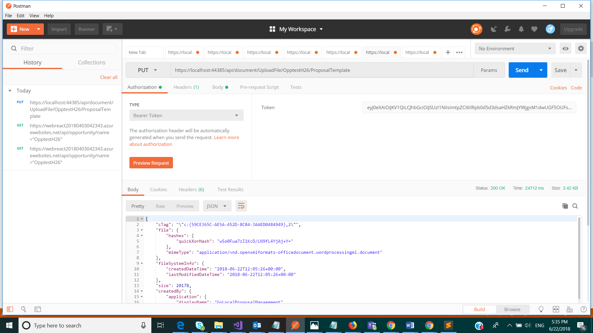

# Upload Proposal Document

Uploading proposal document for an opportunity

## Permissions

The following permission is required to call this API.

- User should have the role of &#39;Loan Officer&#39; in UserRoles list in Sharepoint and hence member of the AD group associated with this role.

## HTTP request

> PUT \{applicationUrl}/api/document/UploadFile/[UrlEncode]\{OpportunityName}/ProposalTemp

late

| **Key** | **Value** |
| --- | --- |
| Authorization | Bearer {token}. Required. |

### Request body 

| **Option** | **Key** | **Value** |
| --- | --- | --- |
| form-data | file | {choose file to be uploaded} |

### Response

If successful, this method returns 200 OK response code.

### Example

##### Request

Here is an example of the request.

> PUT \{applicationUrl}/api/document/UploadFile/\{OpportunityName}/ProposalTemplate

##### Response

> If successful, this method returns 200 OK response code.

##### Screenshot from Postman

